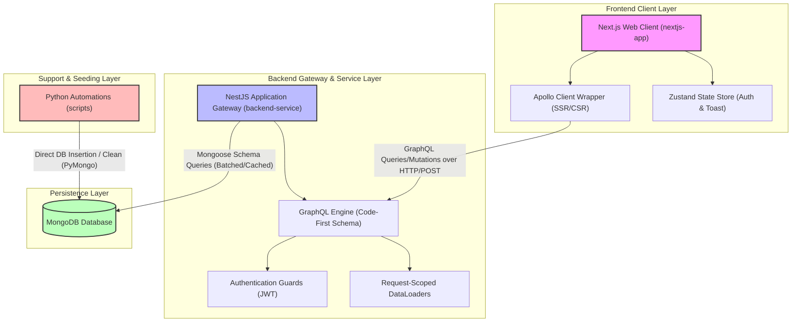

# Enterprise Blog Platform Monorepo

An enterprise-grade, highly performant, and containerized monorepo hosting a modern blog platform application. It consists of a robust NestJS GraphQL backend service, a performant Next.js React client with Server-Side Rendering (SSR) capabilities, and a comprehensive suite of automated database seeding and orchestration utilities.

---

## 1. Project Overview & Monorepo Philosophy

The repository is structured as a **service-oriented monorepo** to maximize developer velocity, enforce strict type boundaries, and consolidate infrastructure tooling. 

By grouping the backend service, frontend client, and seeding scripts in a single repository, the project achieves:
* **Single Source of Truth**: Shared domain models, GraphQL schemas, and validation parameters are tightly coupled and synchronized.
* **Unified Infrastructure**: A shared orchestration layer (`docker-compose.yml`) defines the networking and container relationships, making it trivial to spin up isolated development, testing, and production-like environments.
* **Hermetic Component Isolation**: While code exists in a single repository, each folder (`backend-service`, `nextjs-app`, `scripts`) operates under strict domain boundaries, connecting exclusively via well-defined network protocols.

### Service Boundaries & System Flow



1. **Frontend App Router Client (`nextjs-app`)**: Serves as the user-facing presentation and interaction layer. It uses Server-Side Rendering (SSR) to retrieve page structures and dynamic data rapidly, and falls back to React Client Components (CC) for highly interactive capabilities.
2. **Backend API Service (`backend-service`)**: Built on NestJS, it acts as a headless GraphQL engine. It manages business logic, authorization boundaries, and resolves request data efficiently via specialized data layers.
3. **Database Layer (`MongoDB`)**: Houses our persistent data, utilizing indexes and compound keys to guarantee O(1) or O(log N) operations for posts, likes, users, and comments.
4. **Data Generation & Seed Layer (`scripts`)**: An independent, lightweight Python execution suite that interfaces directly with the database to prepopulate complex relations, enforce schema integrity during development, and reset environments cleanly.

---

## 2. Repository Structure

```bash
.
├── backend-service/      # NestJS headless GraphQL API service (TypeScript)
│   ├── src/              # Source code structured by modular features
│   ├── test/             # End-to-end (E2E) integration test suites
│   ├── package.json      # Dependencies (NestJS 11, Mongoose, GraphQL, Apollo Server)
│   └── tsconfig.json     # Strict TypeScript compiler configurations
├── nextjs-app/           # Next.js App Router client using React 19 (TypeScript)
│   ├── app/              # Declarative App Router filesystem pages and layouts
│   ├── components/       # Reusable, atomic UI and feature components
│   ├── lib/              # Shared libraries (ApolloWrapper, Zustand stores, GraphQL tools)
│   └── package.json      # Dependencies (Next.js 16, React 19, Apollo, Zustand)
├── scripts/              # Automated database seeding, generation, and cleanup utilities
│   ├── generators/       # Entity mock-data generators (Users, Posts, Comments, Likes)
│   ├── utils/            # Python-based logging and execution helpers
│   ├── clear.py          # Direct MongoDB clean script
│   └── seed.py           # Main orchestration seeder connecting to MongoDB
├── docker-compose.yml    # Development and staging multi-container configuration
├── .env                  # Global environment boundaries
└── pyrightconfig.json    # Strict pyright settings for Python automation scripts
```

---

## 3. Detailed System Architecture

### GraphQL Communication Flow
The frontend and backend communicate exclusively through a single GraphQL endpoint over HTTP POST. 
* **Type-Safety**: The schema is defined code-first on the NestJS backend and compiled into `schema.gql`. The frontend consumes this schema to maintain tight, compile-time typescript type safety via `lib/graphql/types.ts`.
* **Zero Over-fetching**: The frontend explicitly requests the exact fields needed for a specific layout. For nested entities (e.g., fetching a post's author or checking if the current user liked a comment), the backend resolves fields independently.
* **N+1 Prevention**: Specialized, request-scoped dataloaders in the backend batch individual, nested field queries into a single Mongoose `$in` operation within a single execution tick, caching results to ensure peak resolver efficiency.

### Authentication & Authorization (JWT)
* **Stateless Security**: The system leverages JSON Web Tokens (JWT) for stateless user authentication.
* **HTTP Bearer Tokens**: Authenticated client requests append an `Authorization: Bearer <Token>` header.
* **GraphQL Context Parsing**: The NestJS gateway parses the header within the GraphQL execution context during request bootstrap.
* **Guards & Decorators**: Resolvers use `@UseGuards(GqlAuthGuard)` to prevent unauthenticated access. Decoded payload elements are injected into resolvers natively using the custom `@CurrentUser()` decorator.

---

## 4. Tech Stack Overview

| Category | Technology | Primary Role in System |
| :--- | :--- | :--- |
| **Backend Framework** | **NestJS (v11)** | Modular, enterprise-grade architecture, dependency injection, and resolver/service framework. |
| **API Protocol** | **GraphQL (Apollo Server v5)** | Highly expressive, single-endpoint query engine with strict schemas. |
| **Frontend Client** | **Next.js (v16) / React 19** | App Router rendering architecture, combining React Server Components (RSC) and Client Components. |
| **State Management** | **Zustand (v5)** | Lightweight, reactive external state stores for global client sessions and transient UI states. |
| **Database Engine** | **MongoDB / Mongoose (v9)** | Document store optimized for relational nesting and fast, index-driven lookups. |
| **GraphQL Client** | **Apollo Client (v4)** | SSR-compatible data fetching, client-side caching, and query hydration wrappers. |
| **Validation Layer** | **Zod & Class-Validator** | Deep model and DTO runtime validation on both client and backend layers. |
| **Automation** | **Python 3 / PyMongo / Faker** | Deterministic seeding and database management utility scripts. |

---

## 5. Engineering Principles & Conventions

We follow strict design rules to preserve clean separation of concerns and scaling efficiency:

* **Modular Architecture (Backend)**: NestJS feature modules encapsulate their own resolvers, services, repositories, schemas, and DTOs. Cross-module imports are done exclusively by importing high-level modules rather than raw classes.
* **Feature-First Organization (Frontend)**: Components are grouped by layout contexts (e.g., comments list under the post detail parent) rather than broad generic categorizations.
* **Separation of Concerns**: Resolvers handle GraphQL requests and map inputs; Services enforce business validation and orchestrate data; Repositories abstract the underlying Mongoose driver.
* **GraphQL-First Backend Design**: Models dictate the API capabilities. All mutations are transactional, and queries are structured for optimal data shape retrieval.
* **Reusable UI Design Tokens**: The frontend features a design token framework, maintaining a uniform palette, fluid typography, and consistent spacing rules across all React components.

---

## 6. Future Architecture Direction

As the application scales, the monorepo is architected to support:
* **Full Containerization**: Complete deployment isolation using multi-stage Docker builds orchestrating Next.js standalone outputs and NestJS production build steps.
* **Microservices Readiness**: Because modules in the NestJS application communicate strictly via clear service interfaces, individual domains (such as `users` or `posts`) can be effortlessly extracted into independent NestJS microservices communicating via gRPC or message brokers.
* **Horizontal Scaling**: Leveraging stateless JWT credentials and request-scoped caching layers allows both the backend and frontend nodes to scale out horizontally behind load balancers with zero session synchronization penalty.

---

## 7. Global Documentation Navigation

Explore in-depth documentation detailing each subsystem:

### 📖 [NestJS Backend Documentation](file:///home/subash/Desktop/ebpearls/blog-post/backend-service/README.md)
* [System Design & Module Architecture](file:///home/subash/Desktop/ebpearls/blog-post/backend-service/docs/architecture.md)
* [GraphQL Engine & Resolver Patterns](file:///home/subash/Desktop/ebpearls/blog-post/backend-service/docs/graphql.md)
* [Stateless Authentication Design](file:///home/subash/Desktop/ebpearls/blog-post/backend-service/docs/authentication.md)
* [N+1 Problem & DataLoader Strategy](file:///home/subash/Desktop/ebpearls/blog-post/backend-service/docs/dataloader.md)
* [Mongoose Database Design & Schemas](file:///home/subash/Desktop/ebpearls/blog-post/backend-service/docs/database.md)
* [Backend Directory Conventions](file:///home/subash/Desktop/ebpearls/blog-post/backend-service/docs/folder-structure.md)

### 📖 [Next.js Client Documentation](file:///home/subash/Desktop/ebpearls/blog-post/nextjs-app/README.md)
* [Client Hydration & SSR Architecture](file:///home/subash/Desktop/ebpearls/blog-post/nextjs-app/docs/architecture.md)
* [Apollo Client & State Wrapper Setup](file:///home/subash/Desktop/ebpearls/blog-post/nextjs-app/docs/graphql-client.md)
* [Zustand State Stores & Reactivity](file:///home/subash/Desktop/ebpearls/blog-post/nextjs-app/docs/state-management.md)
* [SEO, OpenGraph, & Headings Hierarchy](file:///home/subash/Desktop/ebpearls/blog-post/nextjs-app/docs/seo.md)
* [Design System Spacing & Tailwind Styling](file:///home/subash/Desktop/ebpearls/blog-post/nextjs-app/docs/styling.md)
* [Frontend Directory Conventions](file:///home/subash/Desktop/ebpearls/blog-post/nextjs-app/docs/folder-structure.md)

### 📖 [Automated Automation Scripts Documentation](file:///home/subash/Desktop/ebpearls/blog-post/scripts/README.md)
* Detailed breakdown of generators, MongoDB direct schema seeding, cleanup operations, mock-data structures, logging boundaries, and safe execution rules.
